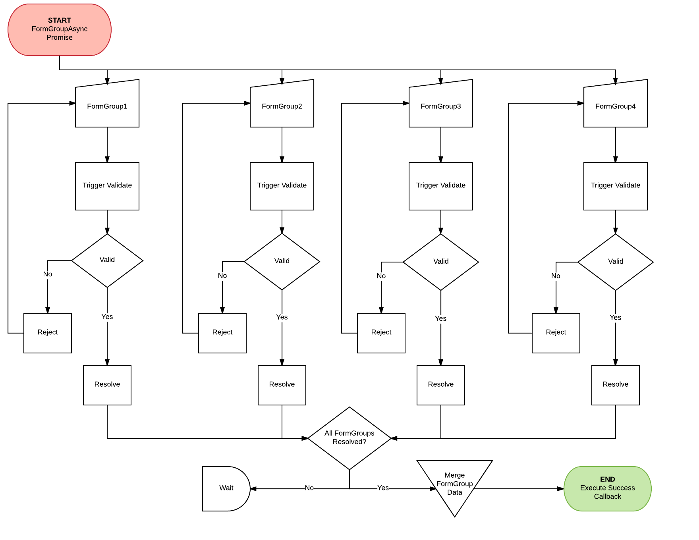

## FormGroups
FormGroups allow you to handle data from multiple groups of form elements. Semantically similar to HTML fieldset but technically different.

Use this if you want to do the following:
 - Break up forms in multiple presentational components
 - Multi-step forms
 - Forms that look like a single form but has multiple behaviours (like postcode lookup)
 - Reuse a subset of your form elements in multiple containers (Like address component shared between delivery and payment).

### Example
For usage example, see https://codesandbox.io/s/lYkVLWwJ7

### How does it work?
When using multiple FormGroups, we have to wait until all groups are valid before firing a final callback method which sends the data to the server. This means, we need to remember somehow what groups are valid/invalid and handle scenarios like when a valid FormGroup becomes invalid etc.

To solve this issue FormGroupAsync was written. This helper class makes use of [Promises](https://developer.mozilla.org/en-US/docs/Web/JavaScript/Reference/Global_Objects/Promise) to allow the component to wait for every single FormGroup to be valid before calling the final callback method.

For usage example, see https://codesandbox.io/s/lYkVLWwJ7

